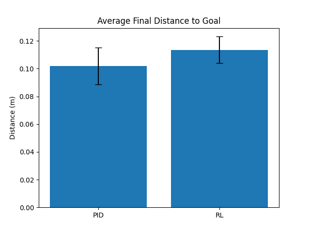
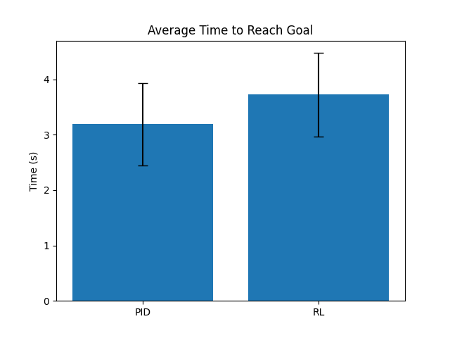

# Robotics Pipeline with PID and Reinforcement Learning (RL) Controllers

This repository contains a complete robotics pipeline for benchmarking and comparing the performance of two different controllers: a classical PID controller and a Reinforcement Learning (RL) model, using robotic simulation in PyBullet. The system is designed to detect root tips in a plate, predict their coordinates using a CV model, and perform robotic inoculation using either PID or RL.

---

## Features

- **Simulated Environment**: A PyBullet-based robotics environment for simulating multi-robot systems.
- **Computer Vision Integration**: A TensorFlow-based deep learning pipeline for root detection and coordinate extraction.
- **Controllers**:
  - **PID Controller**: Classical control mechanism for achieving target positions.
  - **RL Controller**: Reinforcement Learning-based model using PPO (Proximal Policy Optimization).
- **Benchmarking**: Evaluate and compare PID and RL controllers based on time and accuracy.
- **Visualization**: Plot benchmarking results (time and distance to goal).

---

## Directory Structure

```
.
├── sim_class_robotics_pipeline.py    # Simulation class for PyBullet environment
├── cv_pipeline2.py                   # Computer Vision pipeline for root detection
├── pid_class.py                      # PID controller implementation
├── robotics_pipelin_final.py              # Main simulation file for PID or RL
├── benchmark.py                      # Benchmarking script for comparing controllers
├── README.md                         # This README file
└── textures/                         # Texture images for simulation
    └── _plates/                      # Plate images for root detection
```

---

## Requirements

### Python Libraries
- Python 3.8+
- TensorFlow 2.x
- NumPy
- Matplotlib
- OpenCV
- PyBullet
- Stable-Baselines3


## Setup Instructions

1. **Clone the Repository**:
   ```bash
   git clone https://github.com/your-username/robotics-pipeline.git
   cd robotics-pipeline
   ```

2. **Prepare Textures and Models**:
   - Place texture images in the `textures/` folder.
   - Place plate images in `textures/_plates/`.

3. **Pre-trained Models**:
   - RL model (`best_model.zip`) path: Update `MODEL_ZIP_PATH` in `robotics_pipeline.py` and `benchmark.py`.
   - CV model (`232430_unet_model_128px_v9md_checkpoint.keras`) path: Update `CV_MODEL_PATH` in the same files.

4. **Run Simulation**:
   - For RL-based simulation:
     ```bash
     python robotics_pipeline.py
     ```
   - For PID-based simulation:
     Edit `use_rl` in `robotics_pipeline.py`:
     ```python
     use_rl = False
     ```

5. **Run Benchmarking**:
   ```bash
   python benchmark.py
   ```

---

## Components and Explanation

### 1. Simulation Class (`sim_class_robotics_pipeline.py`)
- Handles the PyBullet simulation.
- Creates robots, specimens, and pipette positions.
- Integrates with the Computer Vision pipeline for plate image processing and root coordinate extraction.
- Supports visualization in a rendered PyBullet environment.

### 2. Computer Vision Pipeline (`cv_pipeline2.py`)
- **Pre-processing**: Loads and processes grayscale plate images.
- **Segmentation**: Uses a pre-trained TensorFlow model for root detection.
- **Post-processing**: Connects fragmented roots and skeletonizes them.
- **Coordinate Conversion**: Converts root tip coordinates to robot space.

### 3. PID Controller (`pid_class.py`)
- Implements a PID controller for X, Y, Z axis control.
- Supports fine-tuning using proportional, integral, and derivative gains.

### 4. Main Pipeline (`robotics_pipeline.py`)
- Simulates inoculation using either PID or RL controllers.
- Reads root tip coordinates from the CV pipeline.
- Executes robotic actions to achieve target positions.

### 5. Benchmarking Script (`benchmark.py`)
- Benchmarks PID and RL controllers by simulating root tip inoculation.
- Records time and distance for each controller.
- Visualizes results using Matplotlib.

---

## Usage Examples

### Run RL-based Simulation
```bash
python robotics_pipeline.py
```

### Run PID-based Simulation
Set `use_rl = False` in `robotics_pipeline.py`:
```python
use_rl = False
```
Then execute:
```bash
python robotics_pipeline.py
```

### Benchmarking
```bash
python benchmark.py
```

---

## Results

- **PID Controller**: Provides classical control, suitable for predictable environments.
- **RL Controller**: Learns dynamic behavior, better suited for complex and non-linear tasks.

Results are visualized as bar plots comparing:
1. **Average Time to Reach Goal**.
2. **Average Final Distance to Goal**.


## Example Output

### Bar Plot: Time Comparison



### Bar Plot: Distance Comparison
(
)

Overall the RL performance is worse but just marginally, it very closely gets to PID's performance, on some runs it is faster and accurate. However, due to computational constraints, limitations and the little difference between the two, I would prefer to use the PID controller because of its simplicity.


