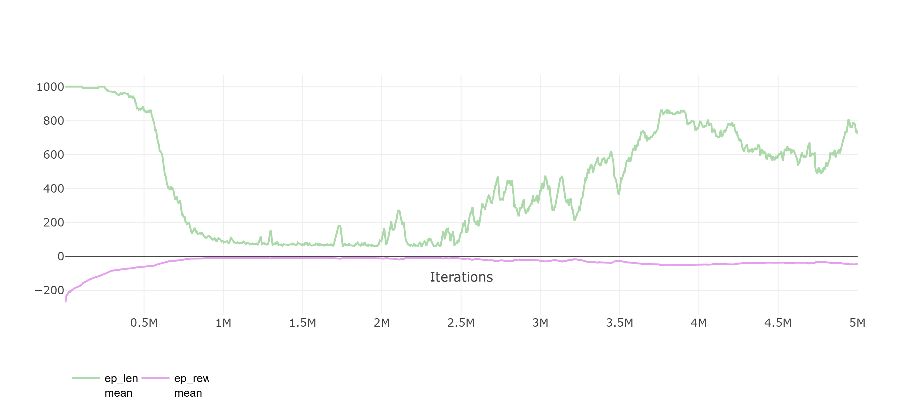
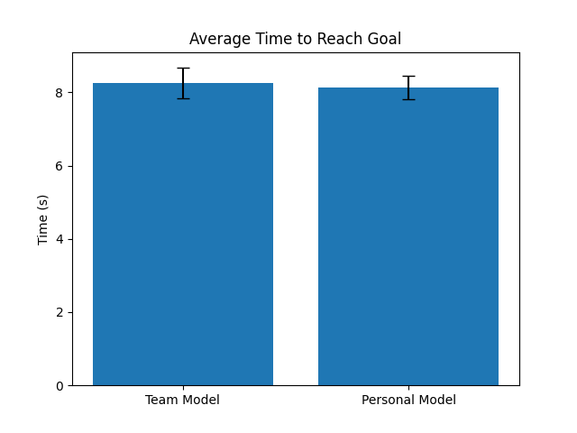
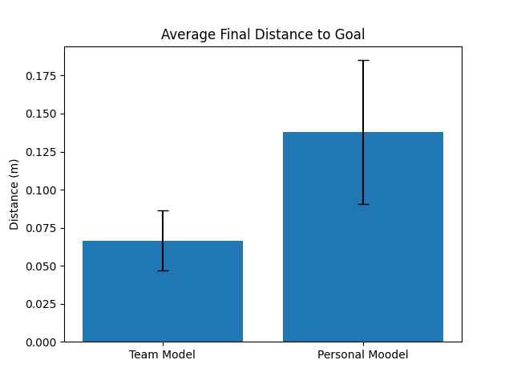

1. Individual Model:
- OT2_RL_Training_v9:
batch_size: 64
learning_rate: 0.0003
n_epochs: 10
n_steps: 2048
total_timesteps: 1000000

Very slow improvemen, reward up, episode length down very slowly.

2. Models with common team reward function (defined in: t10envw_full_reward.py), I tuned the epoch number:

- FinaL_V1_epoch10_232430:
batch_size: 128
learning_rate: 0.0001
n_epochs: 10
n_steps: 4096
total_timesteps: 2000000

- FinaL_V1_epoch25_232430:
batch_size: 128
learning_rate: 0.0001
n_epochs: 25
n_steps: 4096
total_timesteps: 2000000

- FinaL_V1_epoch80_232430:
batch_size: 128
learning_rate: 0.0001
n_epochs: 25
n_steps: 4096
total_timesteps: 2000000

- FinaL_V1_epoch60_232430:
batch_size: 128
learning_rate: 0.0001
n_epochs: 60
n_steps: 4096
total_timesteps: 2000000

- FinaL_V1_epoch150_232430:
batch_size: 128
learning_rate: 0.0001
n_epochs: 150
n_steps: 4096
total_timesteps: 2000000

- FinaL_V1_experiment1:
batch_size: 512
learning_rate: 0.0005
n_epochs: 65
n_steps: 4096
total_timesteps: 2000000

- FinaL_V1_experiment2:
batch_size: 1024
learning_rate: 0.0001
n_epochs: 30
n_steps: 4096
total_timesteps: 2000000

- FinaL_V1_epoch50_232430:
batch_size: 128
learning_rate: 0.0001
n_epochs: 50
n_steps: 4096
total_timesteps: 2000000

We saw steady performance in the previouse models, except FinaL_V1_experiment1 all of the models showed steady improvement. But this model achieved the lowest episode lenght and highest reward in the shortest period of time. Out of my model this performed the best.

3. Team's best model:
Final_V2.2:
batch_size: 256
learning_rate: 0.0001
n_epochs: 50
n_steps: 4096
total_timesteps: 2000000

This model reached the lowest episode length of 60, also it got really close to max reward. After like 2 million iterations it starts to become worse and worse. Its peak is around 1.5m iterations with the lowest episode lenght and highest rewards

4. Personal Best model vs Team's Best Model  

Performance is very similar, in the visualized run the team model performs marginally better in inoculating root tips, but other runs showed personal model as faster, so the their performance is very similiar. I decided to go with my personal model as my final.

